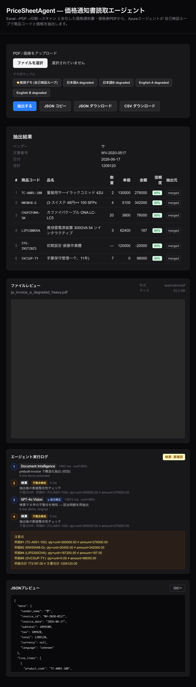

> Microsoft Agent Hackathon 2026（個人部門）応募作品 **PriceSheetAgent** の紹介記事です。
> テーマ「業務改革につながる Agentic AI を作ろう」に対し、**「読み取る」だけでなく「自分の読み取りを検算して、間違いに気づいて直し、直せない分は正直に申告する」** エージェントを作りました。

- 🌐 デモ: https://price-sheet-agent.vercel.app
- 💻 GitHub: https://github.com/nakakei6439/PriceSheetAgent

---

## TL;DR

- Excel→PDF→**印刷→スキャン**と「参照リレー」を経て劣化した価格通知書・仕切り価格通知書・価格表PDF（日英混在・多フォーマット）から、商品コード/品名/数量/単価/金額を抽出する Web アプリ。
- 核は **自己検証ループ**：`Azure Document Intelligence で抽出 → verify_math で qty×unit≒amount を検算 → 不整合を検知したら GPT-4o Vision にヒント付きで再抽出 → 残差は warnings として正直に提示`。
- ハッカソンを通じて得た一番の学びは **「OCR/AI の confidence は当てにならない。だから "検算" でエージェントに自分を疑わせる」** こと。Document Intelligence は劣化スキャンでも `confidence 99%` を返しながら桁を誤読します。その嘘を暴くのが検算ループです。

---

## 1. 解きたかった課題

仕入れ・卸の現場では、取引先から届く**価格通知書 / 仕切り価格通知書 / 価格表**を手で見ながら基幹システムに転記します。これらは

- Excel で作られ、**PDF 化 → 紙に印刷 → スキャン or スマホ撮影 → 再び PDF**、という「参照リレー」で劣化している
- 日本語・英語が混在し、フォーマットも取引先ごとにバラバラ
- 商品コードは業界横断のマスタが無く**自由形式**

という三重苦で、転記とその後の**目視ダブルチェック**に時間が溶けます。単に OCR で読むだけなら既存ツールでもできますが、**「読み取った数字が本当に正しいか」を人間が検算し直す**工程こそが負担の本体です。

PriceSheetAgent は、この **「読み取り + 検算」をエージェントに肩代わりさせる** ことを狙いました。

---

## 2. デモ

公開URL（バックエンドは scale-to-zero のため初回のみ数秒のコールドスタートあり）：

👉 https://price-sheet-agent.vercel.app

トップの「⭐推奨デモ（自己検証ループ）」ボタンを押すと、劣化サンプルPDFが読み込まれ、「抽出する」で実行できます。


*（実際の本番環境での実行結果。エージェント実行ログに自己検証の流れが表示される）*

---

## 3. アーキテクチャ

```
[ブラウザ]
   │ multipart upload (PDF / PNG / JPG)
   ▼
[Next.js 16 (Vercel)]                       ← フロント
   │ POST /extract
   ▼
[FastAPI (Azure Container Apps)]            ← バックエンド
   │ run(pdf_bytes)
┌──────────── 自己検証ループ ────────────┐
│ 1) Document Intelligence (prebuilt-invoice)  │
│ 2) verify_math: qty×unit≒amount, Σ≒total      │
│      └ 不整合を検知したら ▼                    │
│ 3) GPT-4o Vision に「どこが合わない」ヒント付き │
│    で再抽出                                     │
│ 4) verify_math 再検算 → 残差は warnings に      │
└─────────────────────────────────────────────┘
   │ ExtractionResult(meta, line_items, trace, warnings)
   ▼
[Next.js: 結果テーブル + エージェント実行ログ + JSON/CSV 出力]
```

| 層 | 技術 |
|---|---|
| フロント | Next.js 16 + React 19 + Tailwind v4（Vercel） |
| バックエンド | Python 3.12 + FastAPI（Azure Container Apps） |
| 抽出 | Azure AI Document Intelligence（`prebuilt-invoice`） |
| 補完・再抽出 | Azure OpenAI GPT-4o Vision（Microsoft Foundry 経由） |
| 検算 | 自作の `verify_math`（純粋なPythonロジック） |

---

## 4. 核心：なぜ「confidence」ではなく「検算」なのか

当初の設計は「**Document Intelligence が劣化で諦めたら GPT-4o Vision が救済する**」という、confidence をトリガーにしたフォールバックでした。ところが実機検証で前提が崩れます。

> **Azure Document Intelligence は劣化スキャンに非常に頑健**で、`confidence` がフォールバック閾値（0.6）を割ることはほぼ無い。しかも **`avg_confidence 0.99` を返しながら単価の桁を誤読する**ことが普通にある。

つまり **confidence は「自信の表明」であって「正しさの保証」ではない**。これでは「自信があるから OK」と素通りしてしまいます。

そこで主役を **検算ループ** に切り替えました。価格表には `数量 × 単価 = 金額`、`Σ金額 ≒ 文書合計` という**内部整合性**があります。これを使えば、confidence がいくら高かろうと、

```
明細#1 (TC-A001-100): qty×unit = 260,000 ≠ amount = 276,000
```

のような**矛盾を機械的に検知**できます。エージェントは「自分は自信があると言ったが、計算が合わない」と気づき、GPT-4o Vision に**「ここが合わないので見直して」とヒントを添えて再抽出**します。これが Agentic な振る舞い（自己検証 → 自律的な再試行）の中身です。

そして重要なのは、**直せなかった分を隠さないこと**。再抽出しても整合しない明細は `warnings` として正直に提示し、画面には「検算: 要確認」と出します。**「全部完璧に読めました」と嘘をつくより、「ここは人間が確認して」と申告するほうが業務では信頼できる**——これが本作のスタンスです。

---

## 5. 実行ログ（trace）で「考える過程」を見せる

すべてのツール呼び出しは `TraceStep` として記録し、フロントの「エージェント実行ログ」にタイムラインで表示します。本番デモ（`ja_invoice_a_degraded_heavy.pdf`）での実際の trace：

| # | ツール | 状態 | 内容 |
|---|---|---|---|
| 1 | Document Intelligence | info (conf 99%) | prebuilt-invoice で6明細を抽出（7.5s） |
| 2 | 検算 | **不整合検知** | 不整合5件: 明細#1 qty×unit=260,000 ≠ amount=276,000 … |
| 3 | GPT-4o Vision | **↻ 自己修正** | 「検算で5件の不整合を検知 → 該当明細を再抽出」（13.9s） |
| 4 | 検算 | 不整合検知 | 残差を warnings として確定 |

ポイントは **②の「検知」ステップを必ず残す**こと。実装初期はここが内部で消えていて、UI には「DI → Vision → 検算」としか出ず、**一番の見せ場である「自分の誤りに気づいた瞬間」が不可視**でした。`TraceStep.status`（`ok`/`warn`/`info`）を導入し、検知＝黄バッジ、自己修正＝`↻` バッジで色分けすることで、審査員が**推論チェーンを一目で追える**ようにしています。

---

## 6. 実装ハイライト

### verify_math（検算ツール）
税抜/税込のズレを誤検知しないよう、`subtotal`/`tax` を考慮した許容誤差を持たせています。

```python
# qty×unit≒amount を相対誤差2%＋最小絶対値1で判定
def _close(a, b, rel=0.02, abs_=1.0):
    return abs(a - b) <= max(abs_, rel * max(abs(a), abs(b)))
```

### GPT-4o Vision のタイムアウト
強劣化画像で API 呼び出しが数分ハングする事象に遭遇。`AzureOpenAI` クライアントに `timeout` / `max_retries` を必ず設定しています（これが無いと本番でリクエストが詰まります）。

### 構造化出力
GPT-4o Vision は JSON Schema の `strict: true` で `LineItem[]` を直接受け取り、パース失敗を防いでいます。

---

## 7. デプロイで踏んだ落とし穴（Azure 個人アカウント）

ハッカソンは Azure 無料アカウント前提。ここで2つハマりました。

1. **`az acr build`（ACR Tasks）が `TasksOperationsNotAllowed` で禁止** されている（無料系サブスクの制限）＋ローカルに Docker なし。
   → **GitHub Actions でイメージをビルドし ACR にプッシュ**、Container Apps はそれを pull する構成に切り替えて解決。
2. **Vercel の Deployment Protection（SSO）が有効**で、公開URLが全部 `401` に。
   → 審査員がアクセスできないので `vercel project protection disable --sso` で無効化。

バックエンドは `min-replicas=0`（scale-to-zero）で、デモ期間だけ起動＝アイドル時は課金停止にしています。

---

## 8. まとめ

- **「読み取る AI」から「自分を検算する AI」へ**。confidence ではなく内部整合性（検算）でエージェントに自分を疑わせることで、過信による誤読を捕まえられました。
- **直せない部分を正直に申告する**設計が、業務での実用性と信頼につながると考えています。
- Document Intelligence・GPT-4o Vision・自作検算ロジックを **多ツールの自己検証ループ**として束ね、その推論過程を trace で可視化することで、Agentic な価値を「見える化」しました。

劣化した帳票の転記とダブルチェックに追われている現場の、ほんの一歩の業務改革になれば嬉しいです。

---

### 参考リンク
- デモ: https://price-sheet-agent.vercel.app
- GitHub: https://github.com/nakakei6439/PriceSheetAgent
- Azure AI Document Intelligence（prebuilt-invoice）
- Azure OpenAI GPT-4o Vision
