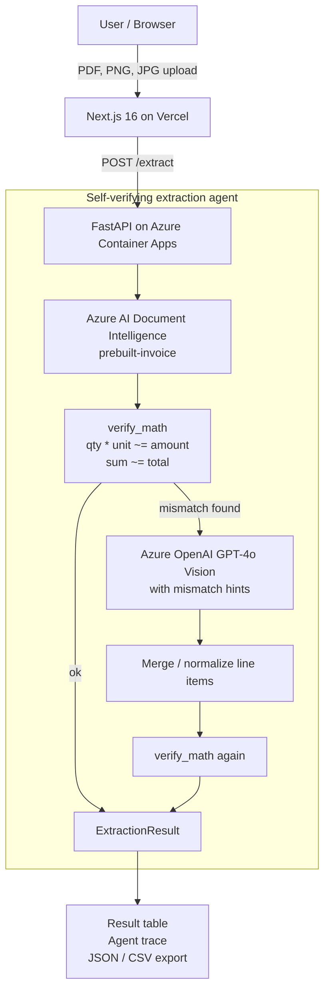

> Microsoft Agent Hackathon 2026（個人部門）応募作品 **PriceSheetAgent** の紹介記事です。
> テーマ「業務改革につながる Agentic AI を作ろう」に対し、**「読み取る」だけでなく「自分の読み取りを検算して、間違いに気づいて直し、直せない分は正直に申告する」** エージェントを作りました。

- 🌐 デモ: https://price-sheet-agent.vercel.app
- 💻 GitHub: https://github.com/nakakei6439/PriceSheetAgent
- 🎥 デモ動画: https://youtu.be/VzxOywOETuw

---

## TL;DR

- Excel→PDF→**印刷→スキャン**と「参照リレー」を経て劣化した価格通知書・仕切り価格通知書・価格表PDF（日英混在・多フォーマット）から、商品コード/品名/数量/単価/金額を抽出する Web アプリです。
- 実行基盤は **Azure Container Apps**、AI は **Azure AI Document Intelligence** と **Microsoft Foundry / Azure OpenAI GPT-4o Vision** を使っています。
- 核は **自己検証ループ**：`Document Intelligence で抽出 → verify_math で qty×unit≒amount を検算 → 不整合を検知したら GPT-4o Vision にヒント付きで再抽出 → 残差は warnings として正直に提示`。
- ハッカソンを通じて得た一番の学びは **「OCR/AI の confidence は当てにならない。だから "検算" でエージェントに自分を疑わせる」** こと。Document Intelligence は劣化スキャンでも `confidence 99%` を返しながら桁を誤読します。その嘘を暴くのが検算ループです。

---

## 1. 解きたかった課題

レガシーな業務システムでは、いまも **Excel帳票を印刷し、返送されたPDFを見ながら入力内容を転記する** という仕事が残っています。入力そのものは、既存システム向けの拡張機能を使ってある程度自動化できています。しかし、その手前にある **「返送PDFから必要な項目を取り出し、入力に使える形へ整える」** 部分にはまだ人手が残ります。特に価格通知書や価格表は、営業・取引先・案件ごとに発生するため、金額の並び方もフォーマットも一定ではありません。

理想だけを言えば、システム全体を改修して、取引先からの情報を最初から一元管理できる形にするのがきれいです。しかし実際には、業務の成り立ちや関係者の多さから、すぐに全体を置き換えられる問題ではありません。現場では当面、形式の違うPDFを受け取り、人が内容を確認して転記する作業が続きます。

さらに会社で自由に使えるAI環境が限られており、使えるのは主に Copilot Chat のような汎用チャットにとどまる、という制約もあります。チャットにPDFを投げて都度聞くことはできても、業務フローとして「同じ項目を安定して取り出し、JSONとして後続の入力自動化に渡し、検算し、要確認箇所を残す」仕組みにはなりません。

そこで、ハッカソンを通じて **生成AIを業務アプリとして組み込み、フォーマットが違う帳票からでも同じ情報を取り出せるか** を試しました。対象にしたのは、取引先から届く**価格通知書 / 仕切り価格通知書 / 価格表**です。これらは

- Excel で作られ、**PDF 化 → 紙に印刷 → スキャン or スマホ撮影 → 再び PDF**、という「参照リレー」で劣化している
- 日本語・英語が混在し、フォーマットも取引先ごとにバラバラ
- 商品コードは業界横断のマスタが無く**自由形式**
- 金額が関わるため、抽出後の**目視ダブルチェック**が避けられない

という難しさがあります。単に OCR で読むだけなら既存ツールでもできますが、**「読み取った数字が本当に正しいか」を人間が検算し直す**工程こそが負担の本体です。

PriceSheetAgent は、この **「形式の揺れを吸収した読み取り + JSON化 + 検算」** をエージェントに肩代わりさせることを狙いました。システム全体をすぐに置き換えるのではなく、既存業務の入口に AI を挟み、返送PDFを後続の入力自動化に渡しやすい構造化データへ変換するためのアプリです。

---

## 2. デモ

公開URL（バックエンドは scale-to-zero のため初回のみ数秒のコールドスタートあり）：

👉 https://price-sheet-agent.vercel.app

トップの「⭐推奨デモ（自己検証ループ）」ボタンを押すと、劣化サンプルPDFが読み込まれ、「抽出する」で実行できます。


*（実際の本番環境での実行結果。エージェント実行ログに自己検証の流れが表示される）*

デモ動画では、以下の3点が伝わるように構成しています。

@[youtube](VzxOywOETuw)

1. 劣化PDFをアップロードし、まず Document Intelligence が高い confidence で明細を抽出する
2. その直後に `verify_math` が `数量×単価≠金額` の不整合を検知する
3. GPT-4o Vision がヒント付きで再抽出し、最後に「直せたもの」と「要確認として残すもの」を trace と warnings で表示する

---

## 3. アーキテクチャ



| 層 | 技術 |
|---|---|
| フロント | Next.js 16 + React 19 + Tailwind v4（Vercel） |
| バックエンド | Python 3.12 + FastAPI（Azure Container Apps） |
| 抽出 | Azure AI Document Intelligence（`prebuilt-invoice`） |
| 補完・再抽出 | Azure OpenAI GPT-4o Vision（Microsoft Foundry 経由） |
| 検算 | 自作の `verify_math`（純粋なPythonロジック） |

この構成で意識したのは、**高価な生成AIを最初から全部に使わない**ことです。まず Document Intelligence で構造化抽出し、検算で矛盾が出たときだけ GPT-4o Vision を呼びます。無料枠・従量課金・レスポンス時間を考えると、ハッカソン用デモだけでなく実運用にも寄せやすい形でした。

---

## 4. 核心：なぜ「confidence」ではなく「検算」なのか

当初の設計は「**Document Intelligence が劣化で諦めたら GPT-4o Vision が救済する**」という、confidence をトリガーにしたフォールバックでした。ところが実機検証で前提が崩れます。

> **Azure Document Intelligence は劣化スキャンに非常に頑健**で、`confidence` がフォールバック閾値（0.6）を割ることはほぼ無い。しかも **`avg_confidence 0.99` を返しながら単価の桁を誤読する**ことが普通にある。

つまり **confidence は「自信の表明」であって「正しさの保証」ではない**。これでは「自信があるから OK」と素通りしてしまいます。

そこで主役を **検算ループ** に切り替えました。価格表には `数量 × 単価 = 金額`、`Σ金額 ≒ 文書合計` という**内部整合性**があります。これを使えば、confidence がいくら高かろうと、

```
明細#1 (TC-A001-100): qty×unit = 260,000 ≠ amount = 276,000
```

のような**矛盾を機械的に検知**できます。エージェントは「自分は自信があると言ったが、計算が合わない」と気づき、GPT-4o Vision に**「ここが合わないので見直して」とヒントを添えて再抽出**します。これが Agentic な振る舞い（自己検証 → 自律的な再試行）の中身です。

そして重要なのは、**直せなかった分を隠さないこと**。再抽出しても整合しない明細は `warnings` として正直に提示し、画面には「検算: 要確認」と出します。**「全部完璧に読めました」と嘘をつくより、「ここは人間が確認して」と申告するほうが業務では信頼できる**——これが本作のスタンスです。

---

## 5. 実行ログ（trace）で「考える過程」を見せる

すべてのツール呼び出しは `TraceStep` として記録し、フロントの「エージェント実行ログ」にタイムラインで表示します。本番デモ（`ja_invoice_a_degraded_heavy.pdf`）での実際の trace：

| # | ツール | 状態 | 内容 |
|---|---|---|---|
| 1 | Document Intelligence | info (conf 99%) | prebuilt-invoice で6明細を抽出（7.5s） |
| 2 | 検算 | **不整合検知** | 不整合5件: 明細#1 qty×unit=260,000 ≠ amount=276,000 … |
| 3 | GPT-4o Vision | **↻ 自己修正** | 「検算で5件の不整合を検知 → 該当明細を再抽出」（13.9s） |
| 4 | 検算 | 不整合検知 | 残差を warnings として確定 |

ポイントは **②の「検知」ステップを必ず残す**こと。実装初期はここが内部で消えていて、UI には「DI → Vision → 検算」としか出ず、**一番の見せ場である「自分の誤りに気づいた瞬間」が不可視**でした。`TraceStep.status`（`ok`/`warn`/`info`）を導入し、検知＝黄バッジ、自己修正＝`↻` バッジで色分けすることで、審査員が**推論チェーンを一目で追える**ようにしています。

---

## 6. 実装ハイライト

### verify_math（検算ツール）
税抜/税込のズレを誤検知しないよう、`subtotal`/`tax` を考慮した許容誤差を持たせています。

```python
# qty×unit≒amount を相対誤差2%＋最小絶対値1で判定
def _close(a, b, rel=0.02, abs_=1.0):
    return abs(a - b) <= max(abs_, rel * max(abs(a), abs(b)))
```

検算結果は単なる内部フラグにせず、`TraceStep` として UI に返します。これにより、ユーザーは「AIが何を根拠に要確認と判断したか」を確認できます。

### プロンプトの工夫

GPT-4o Vision には、自由回答ではなく JSON Schema の `strict: true` で明細配列を返させています。さらに、検算で不整合が出た場合は、次のように **エラー内容そのものをヒントとして再抽出**に渡します。

```python
hint = "計算が合いません: " + " / ".join(warnings[:3])
vis_items, vis_step, _ = vision.extract(pdf_bytes, hint=hint)
vis_step.reason = f"検算で {len(warnings)} 件の不整合を検知 → 該当明細を再抽出"
```

プロンプトでは「多形式・多言語」「スキャン劣化」「読めない文字は `?`」「商品コードは英数字とハイフン/スラッシュのみ」「価格は数値のみ」といった制約を明示しています。ここで大事なのは、モデルに「もう一度読んで」と丸投げしないことです。`qty×unit` と `amount` が合わない明細を具体的に渡すことで、再抽出の探索範囲を狭めています。

### GPT-4o Vision のタイムアウト
強劣化画像で API 呼び出しが数分ハングする事象に遭遇。`AzureOpenAI` クライアントに `timeout` / `max_retries` を必ず設定しています（これが無いと本番でリクエストが詰まります）。

### 構造化出力
GPT-4o Vision は JSON Schema の `strict: true` で `LineItem[]` を直接受け取り、パース失敗を防いでいます。

### trace schema をフロントと共有

バックエンドは `ExtractionResult` に `trace: TraceStep[]` を含めて返します。フロントの `AgentTrace.tsx` はこの schema に依存しているため、`tool` / `reason` / `duration_ms` / `confidence` / `note` / `status` を安定した契約として扱いました。実装途中で検算ステップが trace から落ちるバグがありましたが、`verify_math` 実行時に必ず `TraceStep` を積む形に直して、自己検証の瞬間が UI に残るようにしました。

---

## 7. AIコーディングとAzure設定で踏んだ落とし穴

私は普段から業務改善のためにマクロを作ることはありますが、本職のプログラマーではありません。今回の実装は、Claude Code と Codex にかなり任せる形で進めました。要件を言語化し、詰まったところを一緒に調べ、生成されたコードを動かして確認する、という進め方です。

結果として、Next.js / FastAPI / Azure Container Apps / Document Intelligence / GPT-4o Vision を組み合わせたシステムを、ほぼAIコーディングエージェントと一緒に作り上げることができました。Azure の各サービスとコーディングエージェントを使えば、業務アプリのプロトタイプを作ること自体は非常に速く、正直なところ技術実装そのものに大きな壁は感じませんでした。

むしろ重要だったのは、**何を業務課題として切り出すか**、そして **AIに任せる部分と既存業務に残す部分をどう分けるか** でした。業務の課題を知っている人が、必ずしもフルタイムのプログラマーでなくても、動くプロトタイプまで持っていける。この体験自体も、今回のハッカソンで大きかった点です。

一方で、一番引っかかったのは **Azure GPT-4o を使うためのブラウザ上の設定** でした。Microsoft Foundry でモデルをデプロイし、Azure OpenAI のエンドポイントとキーを取得し、バックエンドの環境変数へ反映する流れは、普段 Azure を触っていないと迷いやすいです。特に、Foundry のプロジェクト画面と Azure ポータル上の接続リソースの関係が分かりにくく、「どの画面のエンドポイントとキーを使えばよいのか」で時間を使いました。

ハッカソンは Azure 無料アカウント前提。デプロイでも2つハマりました。

1. **`az acr build`（ACR Tasks）が `TasksOperationsNotAllowed` で禁止** されている（無料系サブスクの制限）＋ローカルに Docker なし。
   → **GitHub Actions でイメージをビルドし ACR にプッシュ**、Container Apps はそれを pull する構成に切り替えて解決。
2. **Vercel の Deployment Protection（SSO）が有効**で、公開URLが全部 `401` に。
   → 審査員がアクセスできないので `vercel project protection disable --sso` で無効化。

バックエンドは `min-replicas=0`（scale-to-zero）で、デモ期間だけ起動＝アイドル時は課金停止にしています。

## 8. ハッカソン要件との対応

| 要件 | 本作での対応 |
|---|---|
| Azure アプリケーション実行基盤 | FastAPI バックエンドを Azure Container Apps にデプロイ |
| Microsoft AI 技術 | Azure AI Document Intelligence、Microsoft Foundry / Azure OpenAI GPT-4o Vision |
| Agentic AI としての振る舞い | 抽出 → 検算 → 不整合検知 → ヒント付き再抽出 → warnings 提示 |
| 実務インパクト | 価格通知書・価格表の転記後チェックを、OCRだけでなく検算まで含めて支援 |
| 成果物URL | https://price-sheet-agent.vercel.app |
| GitHub | https://github.com/nakakei6439/PriceSheetAgent |
| デモ動画 | https://youtu.be/VzxOywOETuw |

---

## 9. まとめ

- **「読み取る AI」から「自分を検算する AI」へ**。confidence ではなく内部整合性（検算）でエージェントに自分を疑わせることで、過信による誤読を捕まえられました。
- **直せない部分を正直に申告する**設計が、業務での実用性と信頼につながると考えています。
- Document Intelligence・GPT-4o Vision・自作検算ロジックを **多ツールの自己検証ループ**として束ね、その推論過程を trace で可視化することで、Agentic な価値を「見える化」しました。

劣化した帳票の転記とダブルチェックに追われている現場の、ほんの一歩の業務改革になれば嬉しいです。

---

### 参考リンク
- デモ: https://price-sheet-agent.vercel.app
- GitHub: https://github.com/nakakei6439/PriceSheetAgent
- Microsoft Agent Hackathon 2026: https://zenn.dev/hackathons/microsoft-agent-hackathon-2026
- Azure AI Document Intelligence: https://learn.microsoft.com/azure/ai-services/document-intelligence/
- Azure OpenAI GPT-4o: https://learn.microsoft.com/azure/ai-services/openai/
